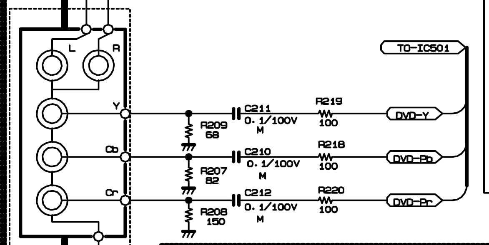

# MOD para habilitar entrada componente na TV LG CR-15Q90A

Este modelo de TV utiliza a mesma placa de tamanhos maiores, mas os circuitos da entrada vídeo componente estão desabilitados, e o que seria a entrada é uma saída de vídeo.

Reabilitar esta funcionalidade é bem simples, mas requer um pouco de paciência e perseverança.

## Aviso obrigatório

Eu fiz no meu aparelho e funcionou. Não dou garantia que funcionará no seu aparelho.

Não sei se funcionará em todas as versões ou variantes desta placa.

A fonte original desta aventura é o link a seguir https://forum.outerspace.com.br/index.php?threads/converter-tv-em-rgb-quem-tem-coragem.545152/post-17628180

Eu apenas repliquei e documentei do meu jeito, além de adicionar o esquema eletrônico.

## Verificando se o modelo suporta este mod.

Abra sua TV tirando os 5 parafusos que prendem a tampa e observe a placa perto da conexão de vídeo.

Se a placa estiver com estes componentes marcados na imagem abaixo faltando, então ela suportará o MOD recolocando o que falta.

Abaixo está a lista de componentes a instalar, de acordo com o [esquema eletrônico](files/CP-15q90a.pdf) deste modelo.

- 3 resistores 100R
- 3 capacitores 100nF
- 1 resistor 68R
- 1 resistor 82R
- 1 resistor 150R

Esquema de instalação:

Depois de instalado fica assim:

O capacitor em C246 e o resistor em R248 devem ser removidos para desabilitar a saída de vídeo.

Os capacitores em C285 e C286 devem ser removidos para evitar ruído da saída de áudio interferindo na imagem, pois as conexões serão utilizadas para entrada de vídeo.

Depois deve-se fazer a ligação para os conectores de saída, transformando-os em entrada.

Deve-se ligar:
- Y com Vout
- Cb com Lout
- Cr com Rout

Depois basta entrar no menu de serviço do aparelho (botão **menu** no controle ao mesmo tempo que o botão **menu** na TV), apertar mais uma vez em **menu** para chegar na tela para habilitar a entrada.

A opção estará como **DVD**, e colocando como "1" será habilitado.

Desligue e religue a TV e deverá estar funcionando sem problemas, podendo a entrada ser selecionada com o botão input, e terá uma nova opção **COMPONENT 480i** disponível.

## E se não funcionar?

O segredo é ter calma e seguir todo o caminho do conector até o chip de vídeo.

Utilize um multímetro e verifique a continuidade em cada etapa:
- do chip até o resistor
- de um lado do resistor ao outro
- do resistor ao capacitor
- do capacitor ao ponto de soldagem do fio
- do fio até o polo central do conector

No meu caso eu acabei destruindo a trilha do sinal Y, e tive que fazer uma ponte direta, mas depois disso funcionou perfeitamente.

## Happy gaming!
